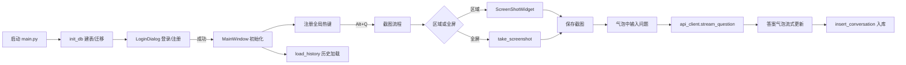
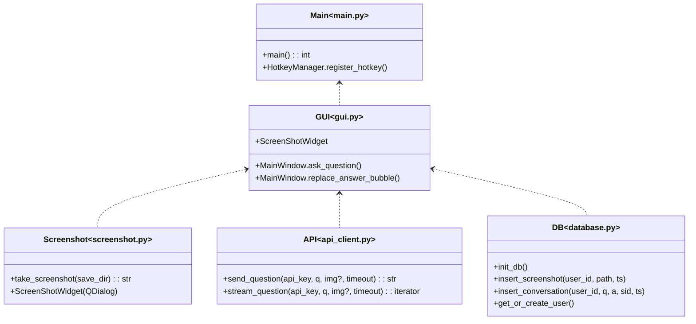

# EyeQ 功能与架构说明（Function Spec）

## 1. 概述
EyeQ 是一款桌面端智能截图问答工具，集成登录/注册、全局热键截图、区域/全屏截图、AI 多模态问答、历史记录管理、系统托盘和个性化设置等能力。采用深色+磨砂玻璃风格，强调一致的交互与高效工作流。

## 2. 主要功能
- 截图
  - 全局热键触发（默认 Alt+Q，可配置）
  - 区域/全屏截图，自动保存并与对话关联
- AI 问答
  - 文本与“图片+文本”的多模态问答
  - 流式答案回显，失败自动回退为一次性回答
- 历史记录
  - 会话和截图双向关联，支持回看与放大预览
- 设置
  - 热键、输入行为、API Key、截图目录
- 界面与体验
  - 深色主题、磨砂玻璃、气泡式聊天、托盘驻留

## 3. 系统架构
- 应用入口：`main.py`
- 界面层：`gui.py`
- 截图子系统：`screenshot.py`
- 模型与API通信：`api_client.py`
- 存储层（SQLite）：`database.py`
- 资源与配置：`assets/`, `config.ini`, `data/`

## 4. AST 风格的程序结构（核心调用骨架）

> 注：上图以“类图”形式概览模块/函数入口，表示接口骨架，实际实现以模块函数与 Qt 类为主。

## 5. 关键模块与函数说明

### 5.1 `main.py`
- `main()`：应用入口；初始化数据库、显示登录对话框、创建 `MainWindow`、注册热键。
- `HotkeyManager.register_hotkey(hotkey)`：注册/更新全局热键，回调发射截图信号。

### 5.2 `gui.py`
- `MainWindow.screenshot_and_ask_mainthread()`：主线程执行截图窗口并连接完成回调。
- `MainWindow.on_screenshot_finished(path)`：将缩略图插入输入框，设置 `current_screenshot_path`。
- `MainWindow.ask_question()`：创建问题/答案双气泡并后台线程调用 `do_reply()`。
- `MainWindow.replace_answer_bubble(item, text, is_markdown)`：在同一答案气泡流式或一次性更新。
- `ScreenShotWidget(QDialog)`：区域截图遮罩与交互，发射 `screenshot_done(str)`。

### 5.3 `screenshot.py`
- `take_screenshot(save_dir)`：全屏截图并以时间戳命名保存为 PNG。
- `ScreenShotWidget`：全屏半透明遮罩，鼠标拖拽选择矩形区域，保存截图。

### 5.4 `api_client.py`
- `send_question(api_key, question, image_path=None, timeout_seconds=30)`：
  - 发送兼容对话格式请求；含超时、HTTP/网络错误解析与严格 JSON 校验。
- `stream_question(...)`：
  - 在不支持原生流式的前提下，按字符切片模拟流式（前端得到逐字更新）。

### 5.5 `database.py`
- `init_db()`：建表与列迁移（为旧表补齐 `user_id`, `password`）。
- `insert_screenshot(user_id, path, ts)` / `insert_conversation(...)`：持久化会话与截图关联。

## 6. 运行时约束与复杂度
- 截图保存与历史查询的开销主要与 I/O 相关，平均开销近似：
\[ T_{save} \approx O(|I|) + O(\log N), \quad T_{query} \approx O(\log N) + O(k) \]
其中 \(|I|\) 为图像数据大小，\(N\) 为历史条目数，\(k\) 为返回条目数。
- 模型请求的等待时间 \(T_{api}\) 由远端服务与网络决定，可通过超时/失败回退保证 UI 不阻塞。

## 7. 错误处理策略
- 无 API Key：在答案气泡内给出提示，不弹窗中断。
- 流式失败：自动回退为一次性回答；入库失败不影响 UI 展示。
- 截图异常：展示错误文案并终止当前轮次。

## 8. 配置与分发建议
- `config.ini`：保存热键、输入行为、API Key、截图目录等。
- Windows 分发：推荐使用 cx_Freeze 生成包含依赖的目录分发；或使用现有 `EyeQ_Release/EyeQ.exe`。
