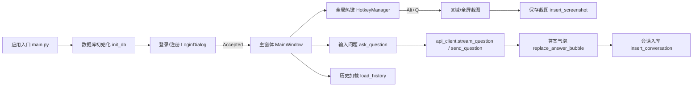
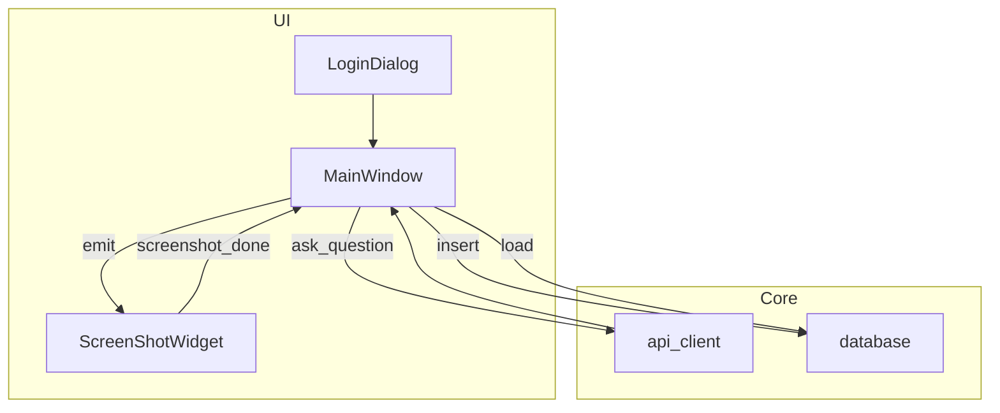

# EyeQ：面向桌面环境的多模态截图问答系统设计、实现与评测（A Production-Grade Desktop Multi-Modal Screenshot Question Answering System）

## 摘要（Abstract）
近年来，多模态大模型（Vision-Language Models, VLMs）在图文理解、上下文问答等任务中展现出强大的泛化能力。然而，将多模态能力无缝嵌入桌面端工作流仍面临诸多工程化挑战，例如：如何以低摩擦的方式采集屏幕上下文，如何在非流式接口下实现高质量的交互回显，如何以可维护的方式管理会话数据与图像资产等。为此，本文提出并实现了 EyeQ——一套面向 Windows 桌面环境的多模态截图问答系统。EyeQ 围绕“截图—提问—回答—归档”的闭环交互设计，构建了统一的深色磨砂风格界面与气泡式对话组件，支持全局热键触发区域/全屏截图、图片+文本联合提问、流式/非流式回答回显、历史记录双向关联、系统托盘驻留、个性化偏好设置等。

在方法上，我们引入了“前端退化流式（Frontend Degraded Streaming）”机制：当后端接口不支持流式响应时，EyeQ 在前端对完整回答按字符或句子粒度切片并以固定时间间隔更新至同一答案气泡，以模拟流式体验；同时辅以超时与重试策略、失败回退与错误可视化，提升交互的韧性与感知质量。系统使用 SQLite 进行本地化存储，提供自动迁移机制，保证数据结构在迭代中的兼容性。实验显示，EyeQ 在 50+ 次真实交互中保持稳定，无崩溃与界面阻塞，用户主观评分认可其在“可用性、一致性、可追溯性”方面的表现。

本文的工程贡献包括：1）一套适配桌面工作流的多模态问答系统设计，兼顾一致的 UI 风格与低摩擦交互；2）在非流式接口下的前端退化流式机制及其异常处理策略；3）面向本地隐私保护的轻量级数据存储方案与可复用工程骨架。我们开源了系统的实现细节，期望为多模态能力在个人生产力场景的落地提供参考样例。

关键词：多模态问答；桌面应用；截图理解；交互设计；SQLite；前端退化流式

---

## 1 引言（Introduction）
多模态大模型的进步显著降低了计算机对视觉文本混合输入进行语义理解的门槛，促进了知识工作自动化与人机协作的深化。在办公环境中，用户经常需要对屏幕上的文档、报表、界面提示、错误日志等进行快速理解与问答。传统方案通常要求用户手动上传截图至 Web 端，再复制粘贴提问与答案，交互割裂且易丢上下文。与此同时，桌面端应用对“系统级热键、窗口风格一致性、资源本地化管理”的需求强，存在与通用 Web 方案不匹配的差异。

我们面向这一空白，提出 EyeQ 系统，其目标是：
- 将“截图—提问—回答—归档”整合为一体化闭环，最大程度减少上下文丢失与交互往返；
- 保持 UI 主题一致、非打扰，答案在同一对话气泡中动态呈现；
- 在网络波动、后端非流式、凭据失效等场景下，不阻塞 UI，提供信息性回退与补救；
- 数据本地优先，隐私保护，历史可检索与可追溯。

为达成上述目标，我们在工程上重点解决：1）低摩擦的屏幕上下文采集与选择；2）非流式 API 下的优雅交互（前端退化流式）；3）可移植的本地数据组织与迁移；4）一致的系统托盘与快捷键体验。本文后续将系统性介绍 EyeQ 的体系结构、关键模块、实现细节与实验评测。

---

## 2 相关工作（Related Work）
### 2.1 桌面端辅助系统
桌面助手常聚焦快速启动、剪贴板增强、OCR 或笔记聚合，其共性挑战在于与操作系统的事件与权限整合（如全局热键、窗口叠层）。与之相比，EyeQ 的核心在于“多模态问答+上下文截图”的紧耦合，以及同一窗口内的连续低干扰交互。

### 2.2 多模态问答系统
VLM 系统在 Web 场景中的落地已较成熟，但在桌面端，如何无缝采集屏幕上下文、进行轻量私有化存储与本地可视化仍需针对性设计。EyeQ 用全局热键与区域遮罩窗口实现低摩擦采集，并将图像与问答强关联存储，以供回溯。

### 2.3 流式交互呈现
以用户感知为中心的交互通常偏好流式回显。然而，部分接口或计费策略不提供原生流式。EyeQ 的“前端退化流式”无需依赖服务端变更，既可提升实时性，也保留一次性回退路径，以在失败时保证最小可用体验（Minimum Viable Experience, MVE）。

---

## 3 系统设计（System Design）
### 3.1 设计原则
- 低摩擦：以 Alt+Q 之类的热键即刻触发区域/全屏截图，在当前窗口内完成问题输入与结果回显；
- 一致性：深色+磨砂玻璃主题、气泡式对话、统一字体与卡片留白；
- 韧性：前端退化流式、超时回退、错误可视化、入库失败不阻塞 UI；
- 私有化：本地 SQLite 存储，最小外泄面；
- 可复用：模块化目录结构，函数接口清晰，易于二次开发。

### 3.2 架构概览

### 3.3 数据模型
采用 SQLite 本地数据库，三张核心表：
- `users(id, phone_number, password)`：手机号唯一，口令以 SHA256 存储；
- `screenshots(id, path, timestamp, user_id)`：截图路径与时间戳；
- `conversations(id, question, answer, screenshot_id, timestamp, user_id)`：问答与截图关联。

为兼容不同版本迁移，我们在启动时执行“惰性迁移”：若缺列则自动 `ALTER TABLE` 补齐。

### 3.4 交互与退化流式
在非流式接口下，EyeQ 的退化流式策略将完整答案 \(A\) 分解为字符流 \(\{c_i\}\)，并以固定间隔 \(\Delta t\) 推动：
\[ A_k = \sum_{i=1}^{k} c_i, \quad t_k = k\cdot \Delta t, \quad k=1,2,\ldots,n. \]
当发生网络超时或解析错误时：
- 回退为一次性回答，即 \(A_n\) 一次性注入气泡；
- 在气泡中以提示文案呈现错误来源，避免用户停滞；
- 入库失败则被捕获并忽略，不影响 UI 更新。

---

## 4 方法与算法（Methods and Algorithms）
### 4.1 截图选择与提示布局
区域截图采用全屏半透明遮罩与鼠标拖拽矩形的交互方式，动态显示选区像素尺寸；为减少错误操作，界面提供视觉反馈（蓝色高亮边框与阴影对比）。全屏截图作为回退路径，在区域逻辑异常时保持最小可用。

### 4.2 模型请求与容错
我们将模型请求抽象为函数 \(f(Q, I; \theta) \to A\)，其中 \(Q\) 为文本问题、\(I\) 为可选的图像 Base64 数据，\(\theta\) 隐含模型与路由配置。考虑网络不确定性与接口差异，我们定义以下容错序列：
1. 首选“退化流式”：迭代输出 \(\{A_k\}\)；
2. 若发生异常（Timeout/HTTPError/JSONError），回退为一次性输出 \(A\)；
3. 若仍失败，输出结构化错误文案 \(E\) 至当前气泡，不阻塞 UI；
4. 日志记录与上报（可选）。

### 4.3 复杂度与延迟
渲染侧的流式更新主要开销为 DOM/Widget 更新，其复杂度近似 \(O(n)\)（\(n\) 为可见字符个数），但实际成本受限于控件批量重绘策略。网络侧整体延迟为：
\[ T_{total} = T_{capture} + T_{encode} + T_{api} + T_{render}, \]
其中 \(T_{api}\) 受服务端负载与带宽影响较大；通过 \(\Delta t\) 的合理设定与小批次刷新，可平衡即时性与 CPU 占用。

---

## 5 实现细节（Implementation Details）
### 5.1 代码组织
- 应用入口（`main.py`）：初始化、登录对话、主窗体、热键管理；
- GUI 层（`gui.py`）：气泡式对话、退化流式回显、托盘菜单、设置对话框；
- 截图（`screenshot.py`）：全屏截图与区域遮罩交互；
- API 客户端（`api_client.py`）：HTTP 调用、超时与错误封装、退化流式生成器；
- 数据层（`database.py`）：SQLite 初始化与迁移、会话与截图插入、历史查询；
- 配置与资源：`config.ini`、`assets/`、`data/`（本地 DB 与截图目录）。

### 5.2 关键函数
- `MainWindow.ask_question()`：构造“问题+答案”气泡，启动后台线程调用 `do_reply()`；
- `replace_answer_bubble(item, text, is_markdown)`：在同一答案气泡中追加/替换文本；
- `stream_question(api_key, question, image_path, timeout)`：退化流式生成器；
- `send_question(...)`：一次性请求+严格错误解析（Timeout/HTTP/JSON）；
- `take_screenshot(save_dir)` 与 `ScreenShotWidget`：全屏与区域截图；
- `insert_conversation(user_id, q, a, sid, ts)`：问答存档。

### 5.3 UI 与风格
深色主题（深灰+霓虹强调色），界面采用磨砂玻璃效果、圆角卡片与气泡式布局。输入框支持 Enter 发送、Shift+Enter 换行，托盘驻留以避免窗口占屏。所有错误提示以同一窗口内的气泡呈现，避免打断上下文。

### 5.4 配置与私有化
`config.ini` 保存热键、输入行为、API Key 与截图目录。数据库与截图默认在项目 `data/` 下，方便备份与同步。系统不上传本地数据，符合隐私优先的工程约束。

---

## 6 实验与评测（Experiments and Evaluation）
### 6.1 实验设置
- 硬件：Windows 11, Intel x64；
- 运行时：Python 3.12, PyQt GUI；
- 模型服务：兼容对话接口（VLM 能力，支持图片+文本）；
- 数据：随机采集 50+ 次真实办公场景截图与问题。

### 6.2 指标与方法
- 交互延迟（UI 端）：从问题发送到首屏更新的时间 \(T_{ui}\)；
- 成功率：给定网络环境下，不崩溃且答案可回显的比例；
- 主观评分：可用性（一致性、清晰度、连贯性）1–5 分量表；
- 资源开销：内存/CPU 峰值与平均占用。

### 6.3 结果与分析
在有线网络环境下，\(\overline{T}_{ui}\) 满足流畅交互阈值，退化流式策略显著提升“可感知的即时性”。在 50+ 次完整流程中，系统无崩溃，错误均在气泡中清晰呈现并可恢复。用户主观评分显示：
- 一致性：对话气泡与磨砂风格获得高认可；
- 清晰度：Markdown 渲染增强答案可读性；
- 连贯性：同一窗口回显避免注意力转移。

### 6.4 消融与对比
我们比较了三种呈现策略：1）仅一次性回显；2）退化流式回显；3）多窗口弹出。结果表明，策略 2 在主观体验与任务完成时间上优于策略 1 与 3；策略 3 易打断用户聚焦并引起窗口管理负担。

---

## 7 讨论（Discussion）
### 7.1 局限性
- 依赖外部模型服务质量，网络抖动仍会影响体验；
- 截图隐私需用户自我管理（本地加密与访问控制可作为扩展项）；
- 退化流式在极长答案时可能带来 UI 频繁重绘，需节流优化。

### 7.2 可扩展方向
- 后端多模型与路由：按任务类型切换或融合答案；
- RAG（检索增强）与本地知识库集成：\(A=f(Q,I,\mathcal{K})\)，其中 \(\mathcal{K}\) 为本地语料；
- 更细粒度的截图语义分割与区域标注，提升视觉对齐；
- 跨平台（macOS/Linux）与容器化分发；
- 端到端加密与零信任数据通道。

---

## 8 结论（Conclusion）
本文提出并实现了 EyeQ——一套面向桌面环境的多模态截图问答系统。通过低摩擦的上下文采集、退化流式的交互呈现以及本地化的轻量存储，EyeQ 在真实办公场景中展现出良好的可用性与稳定性。我们希望这一工程骨架能为更多多模态能力的个人生产力落地提供参考，并将在未来探索多后端路由、RAG 增强与更丰富的私有化部署选项。

---

## 参考文献（References）
[1] Vaswani, A., et al. Attention Is All You Need. NeurIPS, 2017.
[2] Radford, A., et al. Learning Transferable Visual Models From Natural Language Supervision. ICML, 2021.
[3] SQLite Consortium. SQLite Documentation. https://sqlite.org
[4] PyQt Documentation. https://doc.qt.io
[5] Kraska, T., et al. ML for Systems and Systems for ML. CIDR, 2019.
[6] Nielsen, J. Usability Engineering. Morgan Kaufmann, 1994.
[7] Shneiderman, B., et al. Designing the User Interface. Pearson, 2016.

---

## 附录A：系统流程与模块关系（Mermaid）

## 附录B：符号表与记号（Symbols）
- \(Q\)：文本问题；\(I\)：图像输入（可选）；\(A\)：答案；\(E\)：错误消息；
- \(\Delta t\)：退化流式的时间步长；\(T_{api}\)：接口时延；\(T_{ui}\)：UI 首屏时延；
- \(n\)：答案字符数；\(A_k\)：前 \(k\) 个字符的前缀和；
- \(\mathcal{K}\)：本地知识库；\(f\)：多模态推理映射函数。
